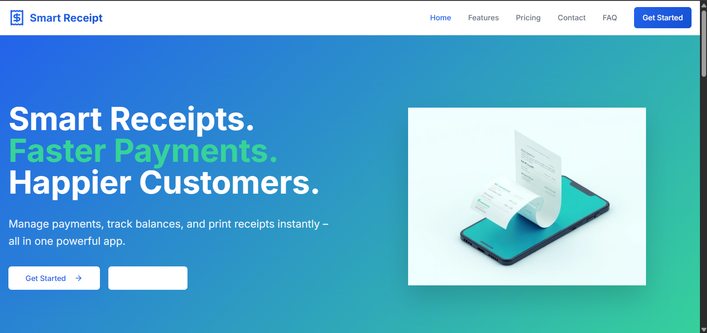
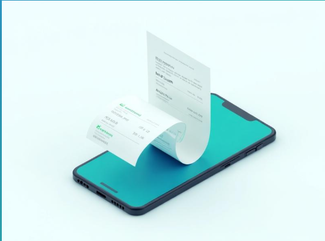
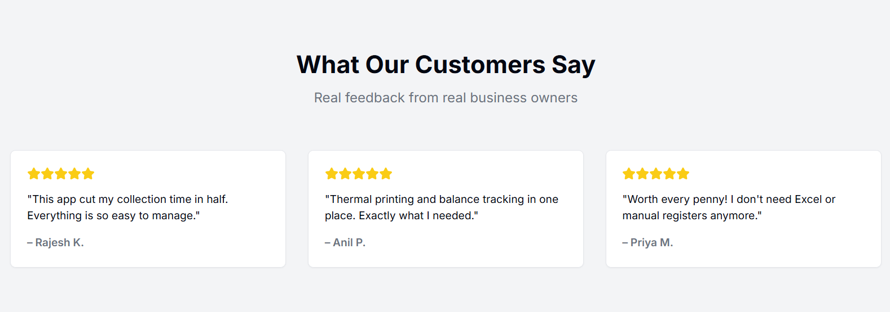

# 🚀 Quick Slip – The Smart Receipt System

> **Smart Receipts. Faster Payments. Happier Customers.**  
> A modern billing & receipt management system built for **Cable TV operators**, **subscription businesses**, and **small-scale service providers**.
---

## ✨ Features

✅ **Customer Management** – Add, update, and delete customers easily.  
✅ **Payment Processing** – Confirm payments before updating balances.  
✅ **Thermal Receipt Printing** – Print professional receipts instantly.  
✅ **Data Export** – Export Excel files sorted by outstanding balance.  
✅ **Collection History** – Track & export payments by date range.  
✅ **Secure Authentication** – Encrypted credentials for safety.  
✅ **Multi-Device Support** – Works on both mobile & desktop.  

---


## 🖼️ Screenshots

| Home Page | Receipt Printing | Customer Management |
|-----------|-----------------|---------------------|
|  |  |  |

---

## 🛠️ Tech Stack

- **Frontend:** React Native (Expo Router)
- **Backend:** Node.js + Express
- **Database:** MongoDB
- **Printing:** Thermal printer integration
- **Auth:** Secure JWT-based authentication
- **Export:** Excel (.xlsx) generation with sorting

---

## 📦 Installation

```bash
# 1. Clone the repository
git clone https://github.com/yourusername/quick-slip.git
cd quick-slip

# 2. Install dependencies
npm install --legacy-peer-deps

# 3. Start the development server
npm start
